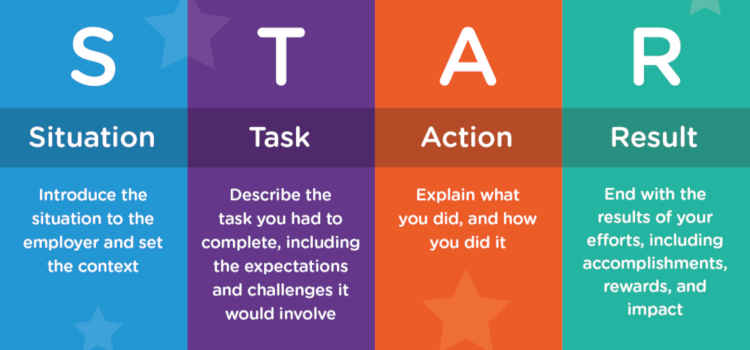

# Table of Contents
- [Table of Contents](#table-of-contents)
- [Note](#note)
- [Summary](#summary)
- [Job-Hunting](#job-hunting)
  - [Applicant Tracking Systems](#applicant-tracking-systems)
  - [Job Ad Analysis](#job-ad-analysis)
  - [Resumes](#resumes)
    - [Write an Incredible Resume](#write-an-incredible-resume)
    - [ATS Resumes](#ats-resumes)
    - [Bullet Point](#bullet-point)
    - [Perspective of a Hiring Manager](#perspective-of-a-hiring-manager)
  - [Cover Letter](#cover-letter)
    - [Things to Avoid](#things-to-avoid)
  - [Interviews](#interviews)
    - [Preparing for interviews](#preparing-for-interviews)
    - [Elevator Pitch](#elevator-pitch)
- [Hard Skills](#hard-skills)
  - [Engineering Report](#engineering-report)
    - [Report Heading](#report-heading)
    - [Table of Contents](#table-of-contents-1)
    - [Organizing Reports as an Engineer](#organizing-reports-as-an-engineer)
    - [Report organization overview](#report-organization-overview)
    - [Analyzing Purpose](#analyzing-purpose)
    - [Reasoning in Engineering](#reasoning-in-engineering)
    - [Writing Sections](#writing-sections)
    - [Paragraphs](#paragraphs)
    - [MEAL in Scientific Writing](#meal-in-scientific-writing)
    - [The Novelity Moves](#the-novelity-moves)
    - [The Structure of Executive Summary](#the-structure-of-executive-summary)
    - [Executive Summary vs Abstract](#executive-summary-vs-abstract)
  - [Presentation](#presentation)
    - [Designing Effective PowerPoints](#designing-effective-powerpoints)
    - [Assertion Evidence Model](#assertion-evidence-model)
    - [How to Describe Complex Images](#how-to-describe-complex-images)
    - [Accessible Images](#accessible-images)
  - [Oral Presentation](#oral-presentation)
    - [Signposts](#signposts)
- [Soft Skills](#soft-skills)
  - [Genres](#genres)
  - [Rhetorical Situation](#rhetorical-situation)
  - [Feedback](#feedback)
  - [Unconscious Bias](#unconscious-bias)
  - [Plagiarism](#plagiarism)
    - [What Should We Do?](#what-should-we-do)
    - [Common mistakes](#common-mistakes)
    - [Some Other Plagiarism](#some-other-plagiarism)

# Note
I write documents in Markdown, a format that's suitable for web browsing but not for paper pagination, so the page breaks might appear unnatural. The rendering of bold text in PDFs can also be different from Markdown. Therefore, I've included a link to the GitHub rendering. The web page may be taken down after grading, so if you need a backup, please download it.
* Author: Dong-Lin Wu
* Email: dw73@rice.edu
* Instructor: Dr. Anne-Marie Womack
* Class: ENGI 501 @ Rice University
* Date: Fall 2023
* Github: [repo](https://github.com/donglinwu6066/engi501-communication-guide/blob/main/How%20to%20Get%20Your%20First%20Job.md)

# Summary
<h3>1. The Brochure Content</h3>
The document content is arranged in the order of presentation. For instance, in the Job Hunting section, it starts with the resume and an optional cover letter, followed by the interview. The Hard Skills section revolves around the engineering report and presentation, which are likely to be encountered post-admission. The Soft Skills section, on the other hand, delves into issues more oriented towards ethics.

<h3>2. My Communication Strategies</h3>

In the "Job Hunting" section, the Elevator Pitch is a great way to quickly introduce oneself to others, but it should be adapted to the specific genres and rhetorical situations, such as talking about personal interests or locations related to work and study, and the country of origin. For continuing interactions or appropriate responses, the "Interviews" section offers useful guidance. If there's some familiarity with the background of the conversation partner, like both having attended Rice University, it can quickly build rapport. Communication is a two-way process, and mutual cultural understanding is essential. Interpreting interactions from a positive perspective is crucial, while being mindful of potential unconscious biases, like the tendency to interrupt, which is generally frowned upon in any culture. The section on "Feedback" is helpful, though not always applicable; most conversations should be equal, with content unfolding according to the situation, but positive feedback can make the dialogue more enjoyable. "Signposts" can smooth the transition between topics, even when cultural and language differences exist. 

In terms of conversation duration, a 10-minute limit for first meetings is recommended to create a good initial impression without taking up too much time. For second meetings or larger gatherings, staying under 30 minutes is suitable, deepening the conversation by extending previous topics, like asking about a holiday trip mentioned earlier or complimenting a meal from a previous encounter to evoke positive memories.
# Job-Hunting
## Applicant Tracking Systems
Applicant Tracking Systems (ATS) is a system that scans and summarize resumes for a set of keywords provided by HR.

1. Use keywords from the job description
2. Use standard fonts such as Arial, Tahoma, and Verdana
3. Use simple, straightforward formatting
4. Avoid abbreviations
5. The first time you use an acronym you include the entire phrase followed by the abbreviation— for example, “Registered Nurse (RN).”

For more strategies, refer to **Job Ad Analysis**
## Job Ad Analysis
<h3>Method 1 - Voyant</h3>

1. Save a copy of the job ad
2. Modify into a clean text (remove irreverent content)
3. Text analysis app - [Voyant](https://voyant-tools.org)
4. Analyze relevance

<h3>Method 2 - Itemization (a manpower version of Voyant)</h3>

1. Itemize all sentence/topic in clean text into a list of short ideas

1. Generalize ideas as general topic
2. Conclude the pattern

3. Rearrange text, group together ideas by related topic and rewrite

## Resumes
The purpose of resume is "get an interview", and it is a kind of advertisement.

### Write an Incredible Resume
1. List types of projects, such as Capstone, Side project, in Class project
2. Add positions of work experience
3. Add LinkedIn profile
* Callback rate: Comprehensive > No > Bare-Bones
* The importance: Entry-Level > Mid-Level > Managerial-Level
4. Include the "Right" Keywords
5. Add Measurable Results
* X-Y-Z Bullet Point Formula: Accoplished [ X ] as measured by [ Y ], by doing [ Z ]
6. The Right Length
* Resumes with 475~600 words are at the sweet spot.
7. Buzzwords and Cliches

### ATS Resumes

1. Choose right layout

   Avoid headers, footers, and columns.

2. Easy to read fonts
   12-point font size with Time New Roman, Helvetica, Calibri, Arial, Tahoma, Garamond

3. Standard formatting

4. Concise Headings
   e.g. Work Experience, Education, Certifications.... List headings in order of importance.

5. Incorporate Keywords
     Avoid **Keyword stuffing**, which means tring to stick too many keywords in a sentence.
6. Get the file name right
   e.g. Name-Position-Company.pdf

### Bullet Point
1. Select an action verb
2. Describe what you did, be specific
3. Identify the accomplishment
4. Bonus: Quantify you expericnce

Example: Managed 12 team members in daily operations and procedures to ensure superior guest relations.

### Perspective of a Hiring Manager
List of common mistakes
1. I am the most qualified applicant for this job -> overestimate their competence.
2. Using meaningless words and phrases: passionate, committed, hard-working, detail-oriented, driven -> Unfounded.
3. No/hard to find contact info, can't figure out, different decision without explanation, overblown language -> trash.
4. Interviewers knows that’s their personal prejudice and knows, too. But it doesn't matter.
5. Confidence is fine. But most of these applicants came off as downright arrogant, self-centered, and cocky.
6. Ghosted interviewers -> made a note of this in their files and out.
7. Asking stupid question, such as "Can you tell me about your company?" -> Out.
8. Being rude to the other members of the company -> interviewers inquire about each other -> out.

## Cover Letter
Show evidence of your expertise and your interest in the company

<h3>General Guideline</h3>

1. Be specific
* (x) I am confident that my background fits your requirements.
* (o) I am confident that my background is well-aligned with the requirements of this job. {Explain skills}
2. Conclude effectively
* Final Pitch: Summarize what you could bring to the company a final time.
* The Ask: Express a desire for an interview.
* More information: Refer readers to your resume and contact information.
* Thanks: Thank the reader.
3. Do not mention qualifications you don’t have
* (x) I dont't have experience in a big tech company, but...
* (o) I worked for a successful start up...
4. Do not undercut yourself
* (x) I really struggled with finding ...
* (o) The dataset presented challenges because ...
5. Highlight what you did, not what you learned
* (x) learned, became familiar, figure out ...
* (o) navigated, worked, solve...
6. Tailor the letter
* Company website, Google News, Soical Media

<h3>Introduction Paragraph</h3>

1. Announce the specific position and company you are applying to
2. Demonstrate knowledge of the company’s specific projects, mission, and/or values
3. Summarize how your strongest qualifications/skills add value for them

<h3>Body Paragraph</h3>

STAR Method

<h3>Concluding Paragraph</h3>

1. Final Pitch: Summarize what you could bring to the company a final time.
2. The Ask: Express a desire for an interview.
3. More information: Refer readers to your resume. Include contact information.
4. Thanks: Thank the reader.

### Things to Avoid
1. Don’t stick to a template:  Think about your audience, don't just copy cover letter templates from Google.
2. Don’t rehash your résumé: Focus on the organization you’re writing to and the job description of the open position.
3. Don’t state the obvious: Don’t say you’re a “hard worker. It would be easy to lie about if you weren’t
4. Do your research: Show a familiarity with recent projects, acquisitions and public statements. It doesn’t have to be a lot, but a few sentences to show you’ve put time into it could go a long way.
5.  Focus on what you can offer them: Convince them that you’re the one who would most help them, not that you’d benefit most from it.

## Interviews
### Preparing for interviews
1. Common Questions
*  Tell us about yourself
*  Why do you want to work here
*  Do you have any questions for us
2. Common Question Type
* Identify common/unique theme(s) between questions
      a. Tell us about you experience at Rice
      b. Why are you pursuing a Master's degree in Engineering
      c. What is your educational background
3. New questions (buy some time, only use once)
* That's a really great question. \[Pause\]
* Got it. I nedd a monment to pull together my thoughts for you \[Pause\]
* \[Pause and reflect back\] "So, what you're asking is (paraphrase question)" or "Yopur're wondering how I ..."
* I'm glad you asked about this subject because it's important to me
* \[Nod and breath\]
4. Lead with the conclusion
5. Don't just describe things chronologically
6. Prepare a final sentence
7. Interview questions are almost never about you as an individual - they're about what you can do for the employer
<h3>More tips for common questions</h3>

1. Why do you want to work here?
* prepare 3 reasons
* talk about specifics things--e.g. company projects or mission statement.
* **Enthusiasm**: Enthusiasm about the position and company. This is probably the most important motivation for asking the question—the interviewer wants to see a genuine emotional connection. 
* **Values**: that align with the organization’s culture.
* **Evidence**: that you’ve researched the company and understand their purpose.
* **Substance**: - avoid vague answers, like “I want to be challenged and grow professionally.”
2. Do you have any questions for us?
* ask 1-2 questions
* prepare at least 4 questions beforehand
* you can ask a question about a specific aspect / initiative / value of the company
* You might start a question with, “I saw on your website that…. Could you tell me more about …?”
3. More questions
* Can you tell me about the team I would be working with?
* What is the company’s culture?
* What opportunities exist for advancement?
* What is the most challenging aspect of this job?
* What traits or skills will enable someone in this position to succeed?
* What exciting projects are on the horizon?
* What do you like most about working for this company?

### Elevator Pitch
<h3>Strategy</h3>

1. Catch others attention within 10 seconds.
2. Give details and uniqueness of your achievements.
3. Ends in a way thats invites conversation.e
4. Smile 

<h3>Format</h3>

1. No more than 100 words.
2. Who am I -> My interest -> Skills, Accomplishments -> Conversation starter

<h3>My Elevator Pitch</h3>
Hello, my name is Dong-Lin, and I am a master of computer science student at Rice University. I love to cooperate with interdisciplinary people. For the last two years, I have helped the ROC army develop their website as a full-stack engineer. Also, I reduced about 40 percent of the estimated cost time for a construction company. I am seeking a 2024 summer for software engineering. I would love to hear about your company's openings, and here is my resume.

<h3>Professor's Feedback</h3>

1. <h4>Pronounce the name slowly & clearly</h4>
   Hello, my name is <strong>Dong-Lin</strong>, and I am a master of computer science student at Rice University.

2. <h4>Previous job position first</h4>
   <strong>Rewrite</strong>: 
   I have helped the ROC army develop their website as a <strong>full-stack engineer</strong>. 
   <strong>Into</strong>: 
   I was a <strong>full-stack engineer</strong> for the ROC army to develop their website.

# Hard Skills
## Engineering Report
### Report Heading
Assumption: Readers will jump around between sections
1. Report must contain an Introduction, and introduction can be divided into multiple subheadings as needs
2. The final subheading of introduction should be proposal format/ report layout to explain the layout of the whole report
3. Each section should be able to fully do its job on its own
4. Make headings specific: Consumption patterns -> Changes in water consumption patterns
### Table of Contents
1. Some useful functions, such as automatic table creator in Google Docs
2. Use indentation, bolding, spacing to help eye travel between section
### Organizing Reports as an Engineer
1. Front Matter: Title + Summary + Table of content
* Title: straightforward with small words (of, to, in, a)
* Summary: 1-n paragraph
2. Main Text: Introduction to Conclusions.
* Introductory section (Introduction): Answer the scope of the report, the importance, background information required by audience, and the arrangement of the report.
* Middle sections: Name each section by its content
* Concluding section: Provide a future perspective, and it contains more depth than summary of scope
3. Back Matter: Appendices + Reference
* Appendices: Table of calculations or measurements. A primary information for secondary audiences (less expert)
* Reference: Full brackets numbering

### Report organization overview
Goal of Report Assignment: Critical thinking skills, ability to analyze and interpret data, application of skills in real-world settings
1. Front Matter: Title Page, Executive Summary, Table of Contents
2. Body: Introduction, Middle headings, Conclusion
End Matter: Appendices (if needed), References (in IEEE style)

### Analyzing Purpose 
1. Determine the target audience: How to solve the problem? <-> Why this happen?
2. Determine the format: A set of images for instructions (how) <-> A list of arguemnts for proposals (why)

### Reasoning in Engineering

Problem-Solution Diagram

1. Problem-Solution: Problem Definition + Solution statement + Evaluation
* Evaluation: How to fulfills the requirements, the constraints, and the counterclaim

1. Comparison & Contrast: Comparative Claim + Basis of Comparison + Justification of Claim
* A part of evaluation of a solution
2. Cause-Effect:
3. Definition: Answer the questions, “What is it?”
* Definitions are short in engineering documents, often just a sentence or even less.

4. Descriptions:Answer the questions, “What does it look like?” “How does it happen?”
* Big picture to details, Consistent sweeping view (work across - or up or down - the space, proceeding consistently), Sequence of events

### Writing Sections
1. To able audience rest, digest and main attention in the writing
2. Give audiencs a sense of organization, which will allow them to have a deeper understand of the documents
<h4> More details </h4>

1. If we divide a subsection, then it must be followed by another subsection. Because if a section only contains one subsection, it is unnecessary to divide it
2. The names of subsections should be parallel, such as "Mining the Coal", "Transporting the Coal", and "Burning the Coal"
3. Before the first subsection of a section, it should have at least one paragraph that introduces the section to provide the overall background.

### Paragraphs
One concept + one to n supporting details to one paragraph
<h4>Elements of paragraph</h4> 

1. Unity: A paragraph should conern one issue, and it should not end with another wander with another different ideas
2. Coherehce: Use logical bridges and verbal bridges to make the paragraph easily understandable
* Logical bridges: The same idea in a paragraph. Successive sentences can be constructed in parallel form
* Verbal bridges: Repeat keywords, use synonyms, use transition words, pronouns can refer to nouns in previous sentences
3. Topic sentence: Put topic sentence near the beginning of the paragraph.
4. Development: A topic (which is introduced by the topic sentence) should be discussed fully and adequately. Again, this varies from paragraph to paragraph, depending on the author's purpose.
* Ways to develop: Use examples, Cite data, Examine testimony (quotes and paraphrases), Use story, Define terms, Compare and contrast, Evaluate causes and reasons, Examine effects and consequences, Analyze or describe the topic, Offer a chronology of an event.

<h4>When to start a new paragraph?</h4> 

1. When you begin a new idea or point
2. To contrast information or ideas
3. When your readers need a pause
4. When you are ending your introduction or starting your conclusion

<h4>Transitions and signposts</h4> 

1. Transitional Signposts: however, in addition, conversely, meanwhile, etc.
2. Sequential Signposts: firstly, secondly, finally, next, then, etc.
3. Emphasizing Signposts: especially, in fact, notably, significantly, etc.
4. Illustrative Signposts: for example, to illustrate, such as.
5. Summarizing Signposts: in conclusion, to sum up, in summary.

### MEAL in Scientific Writing
1. M: Main Idea (Topic Sentence)
2. E: Evidence
3. A: Analysis
4. L: Link
* Connect the idea of the paragraph back to the overall argument. Or lean forward to the next paragraph as a transition
  

MEAL Example

### The Novelity Moves
The consistent patterns or “moves” that scientific communicators make.
1. Explain the Significance:
* Why should a wider audience care?
* How are people being affected?
* What’s the real world context?
2. Describe the Status Quo
* What is currently known?
* What are people doing to address the issue?
3. Identify a “Gap”
* What is the problem?
* What is missing or unknown?
* What is the flaw?
4. Fill the Gap
* How does my work solve the problem?
* How does my work address the issue in a new way?
* How does my work extend or develop current knowledge?

Novelty Moves Samples

Novelty Moves Example

In fact, we can adapt novelty moves as necessary in different writing genres and situations, such as rearranging, lengthening, shortening, combining, omitting, or duplicating moves.

### The Structure of Executive Summary
To fully summarize a report, highlighting the major points to allow the readers make an informed decision about a project.

1. Directly and clearly state the purpose of the report.
2. Explain the procedures used to fulfill the purpose.
3. Logically present the results.
4. Directly and clearly state the conclusions.

### Executive Summary vs Abstract
| Comparison | Executive Summary | Abstract         |
| ---------- | ----------------- | ---------------- |
| Situition  | Bussiness         | Academy          |
| Length     | Longer            | Shorter          |
| Customer   | Stakeholder       | Other field      |
| Language   | Comprehensible    | Highly technical |
<h4>Tips</h4>

1. Write the summary last to include all information in the article
2. One paragraph = one section in Table of Content

## Presentation
### Designing Effective PowerPoints
Your brain can't handle reading and hearing text at the same time, but it can process image and hearing simultaneously.
<h3>Status-Quo PPT Template Problem</h3>

1. Too much text: It helps speakers, not the audience
2. Distracting visuals
3. Phrases & fragments
### Assertion Evidence Model
1. Assertion-Evidence Model: Sentence heading + visual evidence
   

Assertion Evidence Model

2. The model is a tool, not a rule: In an overview page, you can still use text list. Or only showing a image in some other pag.
3. If the topic is about language, use text as a visual
4. Delivering details verbally or a handout

<h3>Assertion-Evidence Model Samples</h3>

1. State your main point in the slide text
2. Don’t add multiple charts/graphs to a slide
3. Use concise data as evidence
4. If an image is dense, draw attention to the key information
5. If an image is dense, add one piece of information at a time
6. If you need to focus on a key quote or point, you can forego an image sometimes a.k.a. use text as a poster, banner

### How to Describe Complex Images
* Descriptions should be reviewed by someone who has not seen the image, to ensure clearity and effectiveness
* Three basic questions
1. Why is the image there?
2. Who is the intended audience?
3. If there is no description what will the viewer miss? -> What are the most important elements of this image that I need to get.
* STEM Description Guideline: Brevity, Data, Clarity, Drill-Down Organization, Tables & Lists & MathML
* What should the description contains
1. Title
2. Construction of the Image
3. Summarly or Overview
4. Data
If there are tons of information, "Break it down to the parts." Unless the image is straightforward, like a flow chart, you can use a list to describe the decision. Otherwise, use a text block, neutrally focusing on the important, and divide by parts.

Image description for flowchart

Break image into parts

Add description for each part

### Accessible Images
Descriptions will not only make content accessible to deisabled audience but also general people seeing an image for the first time.

Image without proper description

1. Use drill-down organization: Brief summary followed by specific data
2. Use colorblind friendly design
3. Use redundant coding to make images colorblind-friend  
Note: Redundant Coding is "build in multiple ways to understand the information by using different colors and different shapes."

Redundant-Coding

## Oral Presentation
1. Teach audience something new: An unfamiliar, unusual, or unexpected element in a presentation intrigues the audience.
2. Never leave data dangling: Package ground-breaking or paramount data point, and make it appealing to the listener.
3. Memorable headlines: Use a sound bit -  a short, provocative, repeatable phrase that is likely to be retweeted. Such as "We will get woolly mammoths back."

### Signposts
Words phrases and sentences that let the audience know where you are in your presentation and what you are going to do. Neat, short signposts are more effective.

<h3>Exapmle</h3>

* To digress: Let me digress for a minute and talk about the reasons for this.

* Using rhetorical questions to signpost talk.
1. So, what can be learned from this?
2. So, how do we move forward?
3. So, how does this work exactly?
4. So, what are the advantages of this treatments?
***For the Middle of a Presentation***

| Formal                                                                         | Informal                                                           |
| ------------------------------------------------------------------------------ | ------------------------------------------------------------------ |
| **Introducing the first section of your presentation:**                        |                                                                    |
| `I'd like to start/begin by...`                                                | `Let's start/begin by looking at...`                               |
| **Finishing a section and starting a new one:**                                |                                                                    |
| `Well, we've looked at... Now, I'd like to discuss...`                         | `Well, I've told you about... Now I'll move on to...`              |
| `Having discussed... I'd like to move on to...`                                | `Well, we've looked at... Now, let's talk about...`                |
|                                                                                | `So, that was... Now, let's...`                                    |
| **Expanding or elaborating:**                                                  |                                                                    |
| `I'd like to expand/elaborate on...`                                           | `Let me tell you a little more about...`                           |
| `Let's consider this in more detail.`                                          | `Let me give you some more details/information about...`           |
| **Talking about earlier or later points in your presentation:**                |                                                                    |
| `I will elaborate on this later in the presentation.`                          | `More on this later.`                                              |
| `I'll provide you with a more detailed explanation later in the presentation.` | `I'm going to talk more about this later.`                         |
| `To repeat what I said earlier...`                                             | `Do you remember I said...?`                                       |
| `As I mentioned earlier...`                                                    | `As I said earlier...`                                             |
| **Recognizing your listeners' prior knowledge:**                               |                                                                    |
| `As you may be aware of...`                                                    | `You might already know that...`                                   |
| `As you may know...`                                                           | `I'm sure a lot of you know that/about...`                         |
| `I know many of you are familiar with...`                                      | `I'm sure a lot of you have heard...`                              |
| **Focusing audience's attention on visuals:**                                  |                                                                    |
| `May I focus your attention on the...You will notice that...`                  | `Take a look at this slide/chart/graphic etc. You can see that...` |
| `Please direct your attention to the slide/chart/etc.`                         | `Okay, here we can see that...`                                    |

***For the Conclusion of a Presentation***
  
| Formal                                                                                                                                                                                       | Informal                                                                                                                                      |
| -------------------------------------------------------------------------------------------------------------------------------------------------------------------------------------------- | --------------------------------------------------------------------------------------------------------------------------------------------- |
| **Summarizing and concluding the presentation:**                                                                                                                                             |                                                                                                                                               |
| `Finally, let’s summarize some of the main points.`                                                                                                                                          | `Let’s summarize/recap what we looked at today.`                                                                                              |
| `To conclude, I’d like to summarize.`                                                                                                                                                        | `Finally, let’s look back at what we covered today.`                                                                                          |
|                                                                                                                                                                                              | `So, to remind you of what we looked at today...`                                                                                             |
| **Inviting final questions:**                                                                                                                                                                |                                                                                                                                               |
| `Does anyone have any questions or comments before we conclude today?`                                                                                                                       | `Does anyone have any final questions?`                                                                                                       |
| `If you’d like me to elaborate or clarify anything we covered today, please ask.`                                                                                                            | `Okay, does anyone have any questions or comments?`                                                                                           |
| **Responding to tough questions:**                                                                                                                                                           |                                                                                                                                               |
| `If you have a question you don’t have the answer to:`                                                                                                                                       | `If you have a question you don’t have the answer to:`                                                                                        |
| `I want to answer your question completely, but I don’t have that information with me right now. Could you give me your email after the presentation so I can send you a complete response?` | `I don’t have that information with me. Can you give me your email and I’ll send you an answer later today?`                                  |
| `A question you didn’t understand:`                                                                                                                                                          | `A question you didn’t understand:`                                                                                                           |
| `Could you repeat that, please?`                                                                                                                                                             | `Could/Can you repeat that, please?`                                                                                                          |
| `Could you rephrase that, please?`                                                                                                                                                           | `Sorry, I didn’t catch that.`                                                                                                                 |
| `Let me make sure I understand you completely. Do you mean that...?`                                                                                                                         | `Are you saying that...?`                                                                                                                     |
| **Finishing and saying goodbye:**                                                                                                                                                            |                                                                                                                                               |
| `If there are no further questions, I’d like to thank you very much for your attention. If you think of any additional questions, please feel free to contact me.`                           | `Well, I think that’s about it. Thanks for listening. Please contact me later if you have any additional questions or want more information.` |

# Soft Skills
## Genres
are types of of texts to respond a need and fulfill a purpose, they share some features. And we call it **convention**.

<h3>analysis genres</h3>

1. What is it?
2. What does it include?
3. Who reads it?
4. What's it for?

## Rhetorical Situation
analyze the purpose, context, and relationships affecting the communication. One of the most important things to consider in this framework is our audience.

1. Purpose: refers to why you are writing.
2. Communicator: refers to you, the writer/creator/designer of the communication. It is important to examine your own motivation.
3. Audience: refers to your readers/listeners/viewers/users.
4. Message: refers to the information you want to communicate.
5. Context/Culture: refers to the situation that creates the need for the writing.

## Feedback
The characteristics of effective feedback is
1. Start with the positive
2. Be critical yet creative
3. Be prosocial(the style and tone, and you genuinely care)
4. Aim your feedback to the work & not the person
   * (x) your issue is...
   * (o) the issue I see in your work is...
5. Provide actionable suggestions
6. Be future oriented
7. Own your feedback as your opinion

## Unconscious Bias
1. Pay attention to who talks. If someone is overlooked, interrupted, or dismissed, acknoledge them.
2. Pay attention to who is given what task. Make sure everyone has an opportunity to do high status work.
3. Establish a criteria for evaluation options. Then apply that criteria when you are making a decision.
4. Make an effort to include remote team members.
5. Document startegies your group will use to get rid of unconscious bias in your team charter.

## Plagiarism
Plagiarism violates the Rice University Honor Code, Rice University Policy, and the terms of publishing. It could lead to a lawsuit

### What Should We Do?
1. Keep electronic notes
2. Practice paraphrasing
3. Avoid cite any information that you don't remember the source
4. Cite as you go: put citations whenever you use them, even it is the first draft
5. Make clear whose work you are referencing

### Common mistakes
1. Use someone else’s results without citing the source
2. Copy something word for word without using quotation marks, even if you cite the source
3. Change the source wording only minimally, even though you cite the source
4. Use all or part of a visual without crediting the source

### Some Other Plagiarism
1. Find - Replace Method: Only replace specific words in a content
2. Remix: Plagiarize and poor paraphrasing skill from multiple sources
3. Recycle: Reuse a large portion from another paper they have written
4. Hybrid: A more intentional version of remix
5. Mashup: Little modification version of remix
6. 404 Error: Throw instructors off by citing inaccurately
7. Aggregator: Let citation to drive papers' development rather than support papers
8. Re-tweet: Paraphrase content by using many original text (paging with lowercase Roman numerals)